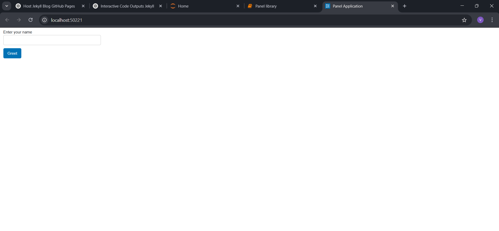
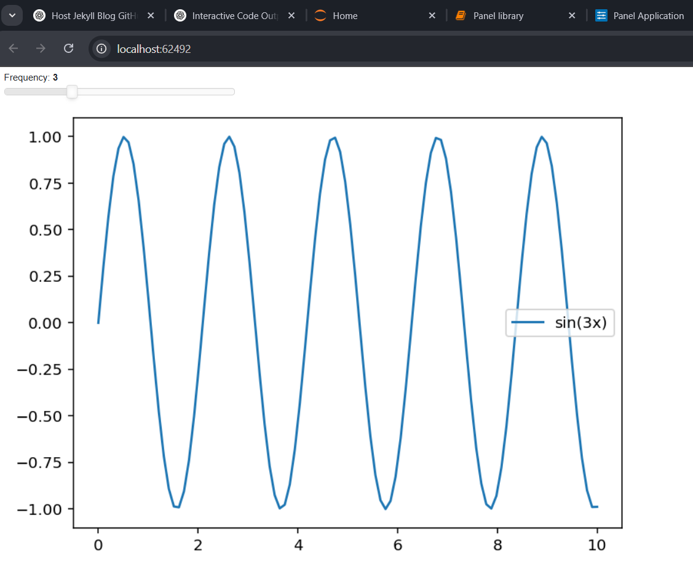

# 🚀 Panel-Easy Python Dashboards.

This blog explains a powerful opensource library called Panel which helps us build interactive web apps and can also be used in data analysis in a very effiecient way.


## 📝 Overview.

  Panel is an open-source Python library designed to simplify the development of various tools, web applications, and data analysis workflows—all within the Python ecosystem. Its seamless integration with multiple Python libraries enhances convenience, particularly for data scientists. Panel provides powerful visualization tools, interactive data tables, and collaborative features, enabling efficient and streamlined workflows.

## ❓‍💬  Why should we use this? 

### 1. Easy to use

   • No need to write heavy HTML or JavaScript code
    for making web apps, everything can be made 
    using python only.

### 2. Supports Multiple Data visualization Libraries
   
   • One of the major  advantages of panel is it can
     do all the things done by libraries like 
     Matplotlib, Bokeh, Holoviews and more by
      integrating all these libraries.

   • Allows combining different visualization tools                 

 
### 3. Interactive Web applications
  
   • Offers sliders, buttons, text inputs and
     dropdowns.
   
   • Enables users to interact with data
     dynamically.


### 4. Supports Live Data and streaming updates
  
   • Can handle real time data updates and stream visualizations dynamically.

### 5.  Deployment & Sharing

   • Dashboards can be exported to static HTML or hosted as a web app.

   • Can be deployed using Flask, FastAPI, or even cloud platforms.


## 🖥️ Installation and setup
 
### Using pip.
```    
pip install panel watchfiles
```

### Using conda
```
conda install panel watchfiles  
 ```  

   ✅ Tip:
We recommend also installing [Watchfiles](https://watchfiles.helpmanual.io/)
 while developing. This will provide a significantly better experience when using Panel’s autoreload features when activating --dev mode. It’s not needed for production.
   
   ✅ Tip:
To incorporate highlighted code sections into your app, you’ll need to install [pygments](https://pygments.org/), a powerful syntax highlighting library.


## ⭐ Key features 
We have already seen why should we use this  library, now lets dive into some more cool features this library offers.
### 1️⃣ Interactive dasboards with minimal code.
   • Create interactive dashboards and web applications with minimal code.

   • It follows an object-oriented approach where Python objects (widgets, plots, layouts) can be directly manipulated.

   • This is a standalone tool that worls well with jupyter notebooks.

### 2️⃣ Supports and integrates multiple Visualization libraries.
• Panel works seamlessly with various plotting libraries as follow:

   • Matplotlib

   • Bokeh

   • Ploty

   • Altair

   • Holoviews

   • Datashader (for large datasets)   

• Lets now see a simple example of integrating panel with matplotlib to make a sine wave more interactive.
```python

import panel as pn
import numpy as np
import matplotlib.pyplot as plt

pn.extension()

def plot_sine_wave(freq=1):

   x = np.linspace(0, 10, 100)
   y = np.sin(freq * x)
   fig, ax = plt.subplots()
   ax.plot(x, y)
   ax.set_title(f"Sine Wave (Frequency={freq})")
   return fig
slider = pn.widgets.IntSlider(name="Frequency", start=1, end=10, step=1)
interactive_plot = pn.bind(plot_sine_wave, freq=slider)

dashboard = pn.Column("# Interactive Sine Wave", slider, pn.pane.Matplotlib(interactive_plot))

dashboard.show()

```


• This creates a more interactive sine wave where we can adjust the frequency of the plot too!

### 3️⃣ Interactive widgets

• Panel provides a variety of widgets including buttons, slides, dropdowns, checkboxes, text inputs and many more that enable user interaction as we have seen in the above sine wave example!

• These widgets help us analyse the data more dynamically.

### 4️⃣ Reactive programming(How do interactive dashboards work?)

• Now, one of the most important features of Panel is  reactive programming, that is if a widgets value changes, then any  linked function or vizualization that is related to the widget will update automatically without needing to manually refresh the page. Let us look at a simple example:
```python
   
   import panel as pn
   pn.extension()
   slider=pn.widgets.IntSlider(name='Value',start=0,end=100,step=1,value=50)

   @pn.depends(slider)
   def update_text(value):
      return f"Slider Value: {value}"
   pn.Row(slider, update_text).servable()

   ```
• Here @pn.depends(slider) automatically updates update_text() whenever the slider value gets changes by the user, no need to call the function manually everytime! The UI updates reactively.


### 5️⃣ Inbuit HTML Templates in Panel

Panel Provides ready-made templates buit in HTML that come with great layouts with great responsiveness. Some of them include:

• FastListTemplate- Great for heavy data dashboards

• MaterialTemplate- Uses Googles Material Design

• BootstrapTemplate- Based on Bootstrap

Given below is a simple way to create a structered dashboard with given inbuit templates:
```python
import panel as pn
pn.extension()
template=pn.template.FastlistTemplate(
   title=" your title "
   main=[
      "main matter you want to write"
   ]
)
template.servable()
```
Here we are using a template called FastlistTemplate which is inbuit present in panel which isb mostly used for dashboards with heavy data.


### 🚀 Lets dive into real time examples and explore some important functions this library offers.

### 1. A Basic Panel app

The following code creates a simple web app with a text input and a button.
```python
import panel as pn

pn.extension()

def greet(name):
    return f"Hello, {name}!"
text_input = pn.widgets.TextInput(name="Enter your name")
button = pn.widgets.Button(name="Greet", button_type="primary")
output = pn.pane.Markdown("")

def update_output(event):
    output.object = greet(text_input.value)
button.on_click(update_output)
app = pn.Column(text_input, button, output)
app.show()
```
Output deployed in a local site:


Here we have used the Widgets function with TextInput and Button(both inbuilt functions) which creates a input box where the user can enter their name and creates a button labeled "Greet". The button_type gives it a styled appearence.
When the user enters their respective name in the TextInput widget and click the Greet button, update_output function is triggered, then the function receievs the input and simultaneously updates the Markdown output with a greeting.
The updated message is displayed instantly without reloading the page.
### 2. Interactive Dataframe Viewer with pandas

```python
import panel as pn
import pandas as pd
pn.extension()
df = pd.DataFrame({
    'Name': ['Alice', 'Bob', 'Charlie'],
    'Age': [25, 30, 35],
    'Score': [85, 90, 95]
})
pn.Column(
    "# Interactive Data Table",
    pn.widgets.DataFrame(df, name="Student Data", width=500)
).show()
```
Output is created as a local site as follows
.png)
.png)

As we can see we can change the order directly in the table clicking in the score column.

This Interactive DataFrame Viewer is a simple web app that displays a table of data in an interactive format. It uses the Panel library to create the interface and Pandas to handle the data. The app starts by importing these libraries and enabling Panel’s extensions. It then creates a Pandas DataFrame (df) containing sample student data, including names, ages, and scores. The data is displayed using pn.widgets.DataFrame, which allows users to scroll, sort, and interact with the table. The elements are arranged in a vertical column (pn.Column), and calling .show() launches the interface in a web browser. In simple terms, this app loads a table of student data and displays it in an easy-to-use, interactive format.

### 3. Live Plot using Matplotlib
Generates dynamic plots with Panel and Matplotlib

```python
import panel as pn
import matplotlib.pyplot as plt
import numpy as np

pn.extension()

def plot_sin(freq=1.0):
    x = np.linspace(0, 10, 100)
    y = np.sin(freq * x)
    fig, ax = plt.subplots()
    ax.plot(x, y, label=f"sin({freq}x)")
    ax.legend()
    return fig

freq_slider = pn.widgets.FloatSlider(name="Frequency", start=0.1, end=10, step=0.1, value=1)
plot_pane = 
pn.pane.Matplotlib(plot_sin(freq_slider.value), tight=True)

def update_plot(event):
    plot_pane.object = plot_sin(freq_slider.value)

freq_slider.param.watch(update_plot, 'value')

app = pn.Column(freq_slider, plot_pane)
app.show()
```
Output is deployed in a local site:

This Live Plot using Matplotlib app creates an interactive graph that updates dynamically when a user adjusts a slider. It uses the Panel library for the interface, Matplotlib for plotting, and NumPy to generate data. The program starts by importing these libraries and enabling Panel’s extensions. The plot_sin(freq) function generates a sine wave graph based on a given frequency. A slider (freq_slider) is created, allowing users to adjust the frequency between 0.1 and 10. The graph is displayed using pn.pane.Matplotlib, and an update function (update_plot) ensures that the plot changes whenever the slider value is modified. The slider and the graph are arranged in a vertical layout (pn.Column), and calling .show() launches the interface in a web browser. In simple terms, this app lets users control a sine wave’s frequency using a slider, instantly updating the graph when adjusted.

### 4. Dashboard with tables
Creates a multi-tab dashboard
```python
import panel as pn

pn.extension()

tab1 = pn.pane.Markdown("# Welcome to the Panel Dashboard 🎉")
tab2 = pn.widgets.Slider(name="Adjust Value", start=0, end=100)
tab3 = pn.widgets.FileInput()

tabs = pn.Tabs(
    ("🏠 Home", tab1),
    ("📏 Slider", tab2),
    ("📂 Upload File", tab3),
)

tabs.show()
```
Output is deployed as a local site:
.png)
.png)
.png)

We can see it created 3 different tabs individually.

This Dashboard with Tabs app creates a web interface with multiple sections, allowing users to switch between different content areas using tabs. It begins by importing the Panel library and enabling its extensions. The app defines three tabs: Home, Slider, and File Upload. The Home Tab displays a welcoming message with Markdown. The Slider Tab contains a slider widget that lets users adjust a value between 0 and 100. The File Upload Tab includes a file upload widget where users can select a file from their computer. These tabs are organized into a multi-tab interface using pn.Tabs, and users can click to navigate between them. When calling .show(), the app opens in a web browser, offering a smooth experience where users can interact with the content in each tab. In simple terms, this app provides an easy-to-use dashboard with different sections for displaying information, adjusting values, and uploading files.

### 5. Real-time Data updating
Live updates using Periodic Callbacks.
```python
import panel as pn
import random

pn.extension()

data = pn.indicators.Number(name="Random Number", value=0, format="{value}")

def update():
    data.value = random.randint(1, 100)

pn.state.add_periodic_callback(update, period=1000)  # Updates every 1 second

app = pn.Column("# Live Random Number Generator", data)
app.show()
```
Output is deployed as a local site:


This creates a random number generator.

This Real-time Data Update (Streaming) app generates a random number that updates every second. It uses the Panel library for the interface and random to generate the numbers. The program begins by importing the necessary libraries and enabling Panel's extensions. The app defines a Number Indicator widget (data), which displays a random number starting at 0. The update() function is created to generate a random integer between 1 and 100 and update the displayed number.
The pn.state.add_periodic_callback() function is used to call the update() function every 1000 milliseconds (1 second), ensuring the number is refreshed in real time. The layout is defined using pn.Column, which displays the label "Live Random Number Generator" along with the indicator widget showing the number. Calling .show() opens the app in a web browser, where users can watch the random number update every second. In simple terms, this app continuously updates and shows a new random number every second, giving a real-time experience.


## 🔹 Use Cases.
### 1. 📊 Data science
We can create interactive dashboards for exploring datasets in real time, for example A dashboard of EDA where people can adjust filters and dynamically visualize the data which is more better and effiecient than sorting manually which also consumes a lot of time.
Key Panel features used would be pn.widgets.Select, pn.widgets.Slider for filtering data
pn.pane.Matplotlib, pn.pane.DataFrame for visualization
@pn.depends for dynamic updates and many more.

### 2. 🤖 Machine Learning Models
Panel is also widely used in building and deploying simple ML inference tools like image classifiers, portfolio makers and many more. For this we can integrate Panel library with ML interfaces like Tensorflow or Pytorch.

### 3. 📈 Finance and Stock Market analysis
Since Panel can easily combine with matplotlib and many other visualization tools, we can analyse stock market trends more easily, for example we can build a cryptocurrency like bitcoin price tracker with dynamic charts of previous data and predictions of up or down. We can include price changes, moving averages and all kinds of indicators used in stock analysis. For this we have to integrate Panel with yfinance(module for finance analysis) along with Plotly(for interactive stock market charts).

### 4. 🌍 Geospatial Data Visualization
We can also build interactive maps based on geographic data, for example COVID-19 spread analysis with interactive heatmap, route analyser for finding best route possible for  reaching a destination. For this we have to integrate pn.pane.Folium( A Panel calling for interactive maps ) with Geopandas for importing maps of different kind.

### 5. 🔬 Scientific Research
We can make simulation of waves, heat distributuon plots, fluid dynamics and many more related to physics and chemistry which helps in making very efficient research for engineers. For this we need to  integrate Holoviews module in Panel with Matplotlib for dynamic engineering simulations.


## 🎯📊 Conclusion

All in all, The Panel library in python is really a gamechanger for building very interactive dashboards, web applications, real-time visualizations with a very minimal effort. This library is made for a large set of people including data scientists, developers, reseachers, or business analyss and more.Panel provides a powerful yet a userfriendly way to ctreate great applications without needing heavy Javascript or complex frontend programs.

From AI/ML model deployment 🤖, financial market analysis 📈, and IoT monitoring 🌍 to business intelligence dashboards 🏢, Panel is widely used across industries. Its seamless integration with Python’s data ecosystem 🐍 (Pandas, Bokeh, HoloViews, Plotly, and more) makes it a must-have tool for anyone looking to turn data into actionable insights.

As we are going through a tech era and tech continues to evolve, the ability to create interacitve and insightful applications will be more valuable than ever. With Panel as your go  to tool, you hhave everything you need to build real-world applications and make informed decisions effortlessly.


## Credits
"This article was inspired by [Panel’s official documentation](https://panel.holoviz.org) with contributions from the open-source community and developed by my team:

K Vishal Reddy, Roll no: 24110151

Allibilli Lohith, Roll no: 24110029

Thathavarthi Manikanta Raju, Roll no: 24110372

#### Learn more about Panel: [Panel/holoviz](https://panel.holoviz.org)
#### Panel Github Repository: [Panel/Github](https://github.com/holoviz/panel)
#### Panel Tutorials: [Panel/Tutorial](https://panel.holoviz.org/tutorials/index.html)
#### Panel Youtube Tutorials: [Panel/Youtube](https://www.youtube.com/c/HoloViz)